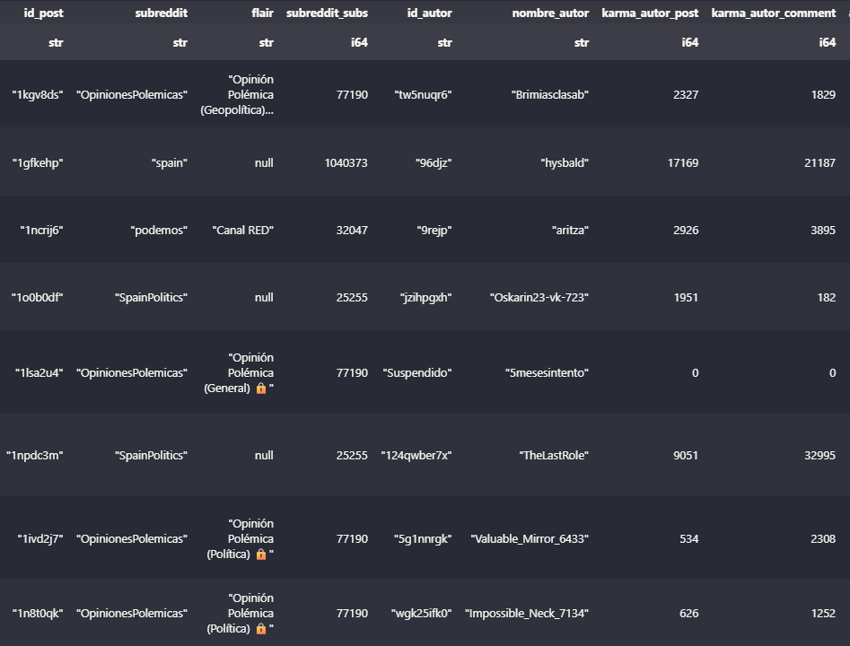
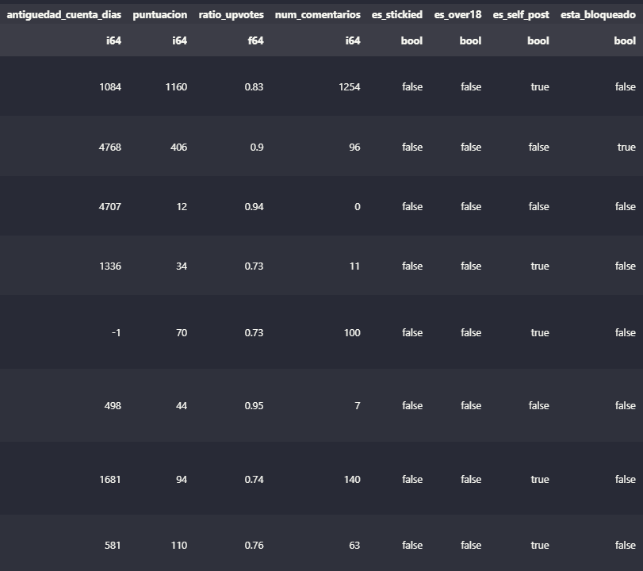
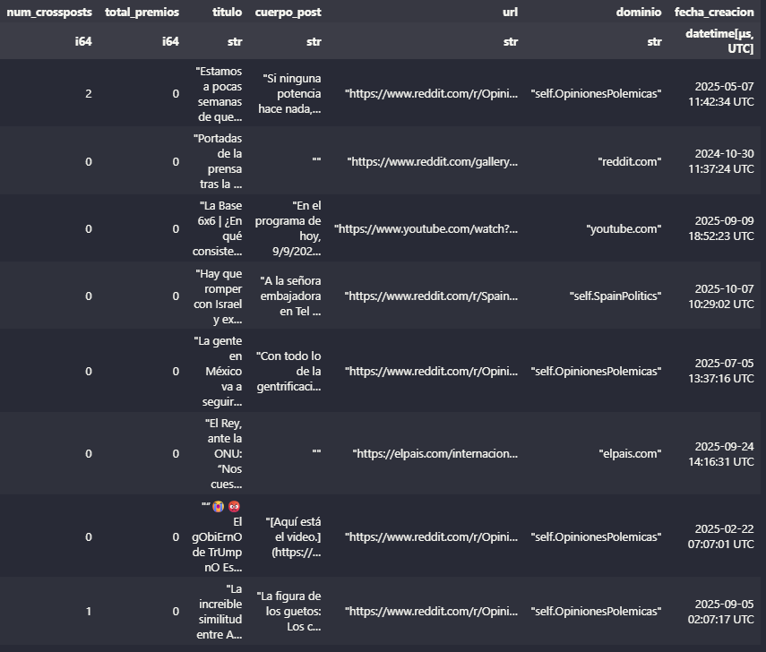

# **Descripción del paper 4**

## **Objetivo general**

Analizar cómo distintos grupos sociales en España reaccionan discursivamente ante el conflicto en Gaza.

Títulos tentativos: 

- ***"Mapeando el Ecosistema del Debate sobre el conflicto en Gaza en España: Una Aplicación de Clustering de Datos Mixtos en Reddit"***

- ***"Clustering de Datos Mixtos para el Análisis Social: Un Estudio de Caso sobre el Debate de Gaza en Reddit-España"***

- ***"Cuantificando la Polarización: Un Análisis de Clustering Mixto sobre la Conversación de Gaza en la Sociedad Española"***

- ***"Más allá de la Polaridad: Caracterización de Grupos de Opinión sobre Gaza mediante Clustering de Datos Mixtos en Reddit"***

## **Procedimiento**

### **Fuentes de datos**

Se utilizará la red social **Reddit** como fuente de datos primaria, extrayendo información relativa a posts relacionados con el topic objeto de análisis.

La elección de Reddit como plataforma principal se fundamenta en varias ventajas metodológicas clave para esta investigación:

- Viabilidad de Extracción: A diferencia de X (Twitter) y sus actuales restricciones de pago, Reddit mantiene una API robusta, gratuita y accesible (utilizada mediante la librería PRAW en Python), lo que permite una recolección de datos a gran escala viable para la investigación académica.

- Riqueza Nativa para Datos Mixtos: La plataforma es ideal para nuestro objetivo de crear una matriz de datos mixtos. Cada post genera de forma nativa un ecosistema coherente de variables que alimentarán  nuestros modelos de clustering.

 
- Estructura Comunitaria Ideal para el Análisis Social: La arquitectura de Reddit está organizada en subreddits (p.ej., r/es, r/podemos, r/SpainLibre). Estos foros actúan como comunidades temáticas e ideológicas pre-definidas. Esto nos proporciona la variable categórica (subreddit) de altísimo valor que permite anclar el análisis de los clusters discursivos en un contexto social ya establecido, permitiendo comparar grupos de opinión entre diferentes "cámaras de eco".

- Calidad del Discurso: El relativo anonimato de la plataforma fomenta discusiones más extensas y candidas en comparación con otras redes sociales, proporcionando datos textuales más ricos y profundos para el procesamiento y la posterior interpretación.

#### El Argumento a favor de considerar una sola red social

El objetivo principal es demostrar la aplicabilidad de nuestros métodos de clustering para datos mixtos. Para hacer eso, necesitamos un dataset lo más "limpio" y metodológicamente sólido posible.

#### 1. El Problema Metodológico: El "Efecto Plataforma"

Si mezclamos datos de Reddit, Bluesky y Telegram en una sola matriz para hacer clustering, introducimos un factor de confusión (confounding variable) masivo: la propia plataforma.

¿Qué significa un score de 10 en Reddit? ¿Es comparable a 10 likes en Bluesky? No.

¿Qué significa un flair de "Política" en Reddit? ¿Es comparable a un custom feed de "Política" en Bluesky? No.

Los usuarios de cada plataforma tienen perfiles demográficos y de comportamiento radicalmente distintos.

El Resultado Más Probable de tu Clustering: Tu algoritmo de clustering (que es bueno) encontraría los clusters más obvios:

Cluster 1: "Los posts de Reddit"

Cluster 2: "Los posts de Bluesky"

Cluster 3: "Los mensajes de Telegram"

El "efecto plataforma" dominaría por nuestro análisis. Anularía tu capacidad de encontrar los clusters sociales que realmente buscamoss, porque estos grupos se verían eclipsados por la diferencia estructural entre las fuentes de datos.

---

#### 2. La Fortaleza Metodológica (Publicable en Revistas de Estadística)

Al centrarte solo en Reddit, creas un ecosistema coherente:

Comparabilidad: Todas tus variables cuantitativas (puntuacion, karma_autor_post, num_comentarios) se miden en la misma escala y contexto. Son directamente comparables.

Significado Consistente: Todas tus variables categóricas (subreddit, flair) pertenecen al mismo universo y tienen un significado compartido por los usuarios de esa plataforma.

Interpretación Válida: Cuando tu método encuentre un cluster, podrás interpretarlo con confianza.

Ej: "El Cluster 2 se caracteriza por un karma_autor_post bajo, flair de 'Debate' y un ratio_upvotes cercano a 0.50".

Traducción: "Es un grupo de usuarios nuevos o polémicos que generan mucha controversia".

Esta interpretación es metodológicamente válida porque todas las variables operan bajo las mismas reglas (las de Reddit).

---

#### 3. Riqueza de Datos Suficiente

Reddit por sí solo te da una matriz de datos mixtos increíblemente rica. Ya tienes:

Texto: titulo, cuerpo_post (y, como siguiente paso, los comentarios).

Quant: puntuacion, ratio_upvotes, num_comentarios, karma_autor_post, antiguedad_cuenta_dias.

Cat: subreddit, flair, es_stickied, es_over18, id_autor (o el estado del autor: 'Suspendido', 'Eliminado').

---

### **Procedimiento de extracción de datos**

La recolección de datos se llevó a cabo durante [Insertar Rango de Fechas, p.ej., "la tercera semana de octubre de 2025"] utilizando la API oficial de Reddit a través de la librería PRAW (vX.X.X) para Python. Para garantizar una recolección exhaustiva y mitigar los sesgos de muestreo inherentes a un único método de consulta, se diseñó e implementó una estrategia de búsqueda sistemática y multifacética.

Esta estrategia se basó en la combinación de tres dimensiones de búsqueda:

- Contexto (Subreddits): Se definió una lista de 7 subreddits clave que representan una muestra transversal del ecosistema hispanohablante en la plataforma, abarcando desde foros generales (r/es, r/spain, r/AskSpain, r/OpinionesPolemicas) hasta comunidades con un claro sesgo político (r/podemos, r/psoe, r/SpainPolitics).

- Contenido (Queries): Se diseñaron cuatro consultas (queries) booleanas para capturar diferentes "marcos" (frames) del discurso. Estas consultas, insensibles a mayúsculas pero sensibles a tildes (incluyendo variantes con y sin acento), fueron:

  - Marco Político-Doméstico: (gaza OR palestina) AND (sánchez OR sanchez OR feijóo OR feijoo OR gobierno OR pp OR psoe OR podemos)
  - Marco Humanitario-Legal: (gaza OR palestina) AND (genocidio OR humanitaria OR onu OR víctimas)
  - Marco de Seguridad/Conflicto: (gaza OR palestina) AND (hamas OR terrorismo OR ataque OR rehenes OR netanyahu)
  - Consulta General (Catch-all): (gaza OR palestina OR israel)

- Muestreo (Criterios de Ordenación): Para contrarrestar el sesgo algorítmico de la API, cada búsqueda se ejecutó cuatro veces utilizando los diferentes criterios de ordenación (sort) que ofrece Reddit: relevance (relevancia), top (más votados), new (más recientes) y comments (más comentados).

Se llevaron a cabo un total de 112 búsquedas únicas (4 queries x 7 subreddits x 4 sorts). Cada búsqueda se configuró con un filtro temporal de un año (time_filter='year'), es decir se considera la actividad de los últimos 12 meses, desde la fecha de consulta, y un límite máximo de 1.000 posts por consulta, conforme al límite de la API.

Dado que esta estrategia (especialmente al variar los criterios de ordenación) inevitablemente captura los mismos posts múltiples veces, no se consideraron estas duplicidades, garantizando la unicidad de cada registro.

---

### **Generación de datos de tipo mixto**

#### **Datos extraidos en crudo de Reddit**

  - **Variables numéricas** 

    - Métricas de engagement: 
       - *puntuacion* (el score neto del post, proxy de apoyo).
       - *num_crossposts* (Nº de veces que se ha 'crossposteado', mide viralidad interna).
       - *total_premios* (Nº total de premios, mide engagement muy positivo).
    - Métrica de Controversia: 
       - *num_comentarios* (proxy de debate o controversia), 
       - *ratio_upvotes* (proporción de votos positivos sobre el total de votos (positivos + negativos))
          
          - Ratio cercano a 1.0 (p.ej., 0.95):

            Significado: Consenso positivo total. 

            Interpretación: A casi todos los que lo vieron y votaron, les gustó. Es un contenido que genera mucho acuerdo (p.ej., un meme muy gracioso, una noticia con la que todos están de acuerdo).

         -  Ratio cercano a 0.50 (p.ej., 0.55):

             Significado: Controversia máxima. 

             Interpretación: El post divide a la audiencia por la mitad. Por cada persona que le da upvote, otra le da downvote. Este es el verdadero "post polémico".

         - Ratio cercano a 0.0 (p.ej., 0.18):

            Significado: Consenso negativo total. 

           Interpretación: A la inmensa mayoría de los que votaron, no les gustó.

    - Métricas de Influencia del Autor: 
       - *karma_autor_post* (Experiencia/Influencia del autor)
       - *karma_autor_comment* (Experiencia/Influencia del autor como debatidor).
       - *antiguedad_cuenta_dias* (Veteranía del autor).

  - **Variables categóricas**

     - Contexto Ideológico: 
       - *subreddit* (La comunidad de origen, p.ej., 'spain' vs 'podemos' vs 'SpainLibre')
       - *flair* (La etiqueta que el usuario/mod le dio al post, p.ej., 'Política', 'Debate').
    - Metadatos del Autor:
       - *estado_autor*: (Procesando id_autor y nombre_autor). (Cat: 'Activo', 'Suspendido', 'Eliminado').
    - Metadatos del Post:
      - *es_over18*: post con contenido para mayores de edad (True/False).
      - *es_stickied*: te dice si un post ha sido "pineado" o "fijado" por los moderadores de ese subreddit (True/False).
      - *esta_bloqueado* (Post con comentarios bloqueados por mods, señal de toxicidad: True/False).
    - Tipo de Contenido/Fuente:
      - *es_self_post* (Booleano: True si es un post de texto, False si es un link/imagen).  
      - *dominio* (El dominio del link, p.ej., 'eldiario.es', 'self.spain', 'youtube.com'. ¡Variable clave!).

#### **Datos generados a partir de datos textuales extraidos de Reddit**

  - **Variables numéricas**

    - *Embeddings:* genera K variables cuantitativas que capturan el significado semanatico del texto. Como K suele ser grande, se pueden usar técnicas de reducción de la dimensión como PCA.
    - *Score de sentimientos:** una puntuación continua que indica la polaridad del texto (negativo, neutro, positvo)
    - *Scores emocionales:* puntuaciones continuas que miden emociones especificas como tristeza, ira, miedo.
    - *Tamaño del post:* medido a través de variables como número de palabras o frases.

  - **Variables categoricas**

    - *Posición en el conflicto:* pro palestina, pro israel, critico con ambos, indefinido, etc.
    - *Tema principal:* 'Tópico 1: Crítica Política ES', 'Tópico 2: Ayuda Humanitaria', 'Tópico 3:  Debate Seguridad/Terrorismo', 'Tópico 4: Crítica a Medios', etc.
    - *Intención del discurso:* 'Opinión', 'Noticia', 'Pregunta', 'Queja', 'Meme/Sátira'.
    - *Menciones:* menciona_politico_es, menciona_hamas, menciona_onu, etc

---

#### **Muestra de datos crudos extraidos de Reddit:**

---

### **Detección y análisis de comunidades (clustering y análisis de datos)**

- Aplicar *nuestros* métodos de clustering para detectar comunidades 

- Interpretación de las comunidades basado en: 

  - Análisis de datos mixtos y textuales

    - Análisis de datos "clásico" para las variables de tipo mixto "clásicas".

    - Ideas para datos textuales:
      Ranking de terminos más relevantes basados en frecuencia de palabras, tf-idf, odss ratio. Nubes de palabras. 
      
    - Idea para refinar el análisis:
      Centrar el análisis de los clusters en el top X posts más relevantes de cada cluster, identificandolos de algún modo, como por ej: el post medoid y los 9 más cercanos a él, para cada cluster.

  - Conocimiento de expertos en el topic social analizado.

